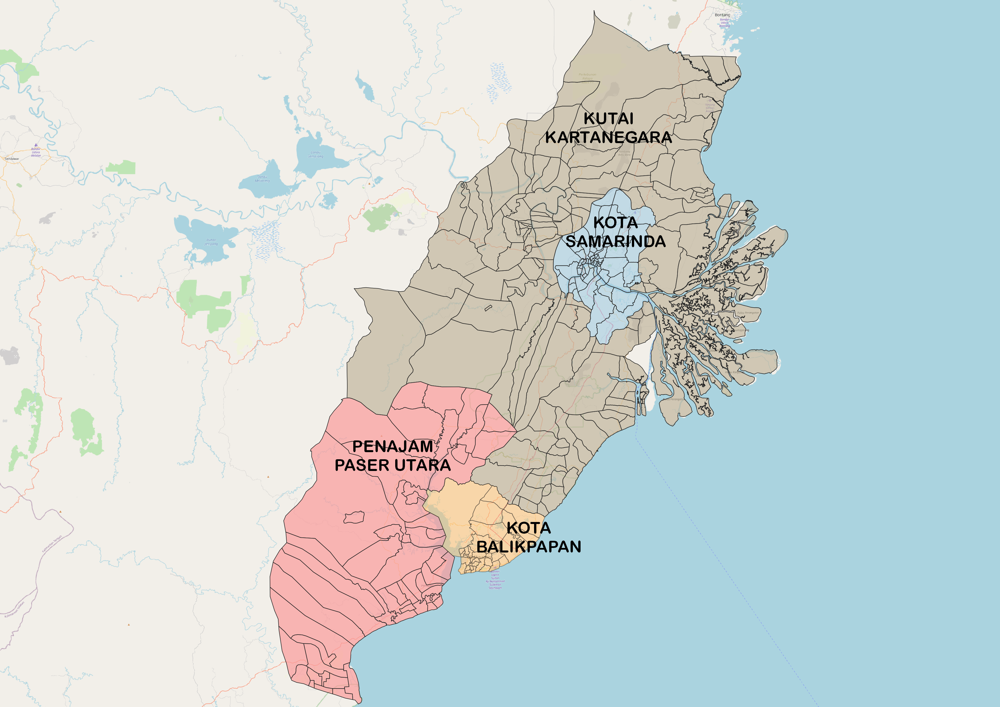

## Introduction 
Jakarta, Indonesia’s current capital, has long been struggling with environmental problems. The seawall constructed to protect north Jakarta from the sea is also decreasing by an estimated 25cm per year, Jakarta is sinking very fast and facing an increasing risk of major flooding as days go by. Moving the capital was thus deemed necessary to spread the economic activities, reduce traffic gridlock and also decrease the population density in the overcrowded Java island that is home to almost 60% of the population.

On the other hand, Kalimantan has a very strategic location as it is located in the centre of Indonesia, making it a suitable location for a capital. After conducting in depth studies for 3 years, the government has decided that the new capital will be built in part of North Penajam Paser regency and a part of Kutai Kartanegara regency in East Kalimantan. Most of the government offices, parliament, military and police headquarters will be relocated to the new capital while Jakarta continues serving as Indonesia’ financial and commercial hub. 

### Project Motivation

According to President Joko Widodo, the relocation of the capital would cost 466 trillion rupiah ($32.7bn). It would thus be important to analyse a variety of factors such as accessibility, economic, transportation, flood risk, safety hazards, environment and other important factors to select a suitable capital site so that precious resources and fundings are not wasted especially in the midst of a pandemic. 

As such, in this project, we studied the selected area (“study area”) and prepared a report of survey highlighting key insights including population density, transportation accessibility, hazard areas including forest fire hotspots and flood risks, and current settlement areas. Finally, site suitability analysis was conducted to recommend the most suitable area as Indonesia's new capital.

## Project Study Area
In this project, we studied sub-districts and districts of: 

1. Kota Balipapan
2. Kota Samarinda
3. North Penajam Paser (selected):
    * Bubulu, Penajam, Sepaku, Waru
4. Kutai Kartanegara Regencies (selected):
    * Anggana, Loa Janan, Loa Kulu, Marang Kayu, Muara Jawa, Samboja, Sanga Sanga, Sebulu Tenaggarong, Tenggarong Seberang, Muara Badak

## Project Objectives
### Objective 1

Our first objective is to prepare a report of survey covering these aspects of our study area to answer these important questions:

   * **Population and Demographic**: How is the distribution of economically          active groups and where are the mostly densely populated areas?
   * **Economic and Business**: What are the available economic and business facilities such as banks, retail and trade?
   * **Transport and Communication**: What are the available transportation options and telecommunication facilities?
   * **Infrastructure**: What are the available infrastructures?
   * **Environment and Hazard**: Where are the areas with high flood risks and concentration of forest fires?
   
### Objective 2

Our second objective is to conduct site suitability analysis uisng Raster based GIS Multiple-Criteria Decision Analysis (GIS-MCDA) to recommend a suitable site as Indonesia's new capital, tapping onto insights we obtained earlier from objective 1. 

## Project Timeline
### Our Gantt Chart

## Delegation of Work
### Task 1: Report of Survey

Theme | Person in Charge
------------- | -------------
Population and Demographic | Hui Qi
Economic and Business | Hui Qi 
Transport and Communication | Winnie
Environment and Hazard | Winnie
Infrastructure | Shereen

### Task 2: Site Suitability Analysis

Factor | Person in Charge
------------- | -------------
Accessibility | Winnie
Economic | Winnie 
Water Transportation | Winnie
Air Transportation | Winnie
Safety Hazard | Hui Qi
Environment Sustainability | Hui Qi
Flood Risk | Shereen
Building Density | Shereen

### Other Miscellaneous Work
Factor | Person in Charge
------------- | -------------
Poster | Shereen
Website | Winnie 
Report Clean Up | Hui Qi
Metadata | Hui Qi

## Scope of Work for Task 1
*In this section, we outlined the maps created for each of the 5 themes.*

##### POPULATION AND DEMOGRAPHICS
For population and demographics, we analyzed the economically active population and population density to determine areas with high population density. For additional insights, sex ratio analysis was also conducted. 

  * Proportion of Population Aged 15-64 in East Kalimantan
  * Population Density in East Kalimantan
  * Bivariate Map showing Population Density and Proportion of Population Aged 15-64
  * Sex Ratio in East Kalimantan

##### ECONOMIC AND BUSINESS
For economic and business, we determined which are the areas with high agriculture and open mining. Additionally, we analyzed the distribution of bank locations, retail and trade. 
  
  * Agriculture Distribution in East Kalimantan
  * Open Mining Area in East Kalimantan
  * Bank Locations in East Kalimantan
  * Retail and Trade in East Kalimantan

##### TRANSPORT AND COMMUNICATION
Distribution of the available transportation modes including air, water and road was analyzed. Additionally, road density and road intersection analysis was also conducted. For communication, we studied the distribution of telecommunication towers. 
  
  * Different Modes of Transportation in East Kalimantan
  * Road Density Analysis
  * Road Intersection Analysis
  * Telecommunication Towers in East Kalimantan

##### ENVIRONMENT AND HAZARD
For environment and hazard, we identified areas with high risks of forest fires and flood. Additionally, areas with huge plots of forests and mangrove forests were also identified. 

  * Forest Fire Hotspots Heatmaps (yearly from 2014-2019, and combined)
  * Major Rivers in East Kalimantan 
  * Slopes Maps: Areas in the Major River Course, Villages near Coastlines
  * Forest Distribution in East Kalimantan

##### INFRASTRUCTURE
For infrastructure, we studied water and energy facilities, alongside sources of energy and buildings distribution in our study area. 

  * Water Facilities Distribution in East Kalimantan
  * Electrical Facilities Distribution in East Kalimantan
  * Sources of Energy in East Kalimantan
  * Housing and Building Distribution in East Kalimantan

## Scope of Work: Task 2
The team first got together to rank the 8 factors in order to derive the AHP scores. The factors map were then created, followed by the combined AHP Suitability Layer. From there, we segregated the sites into suitable/not suitable and finally derived our potential site as Indonesia's new capital. 

In our analysis, we explained why Safety Hazard, Accessibility and Sea Transport are considered the most important factors, followed by a discussion of the advantages and disadvantages of the potential site.
