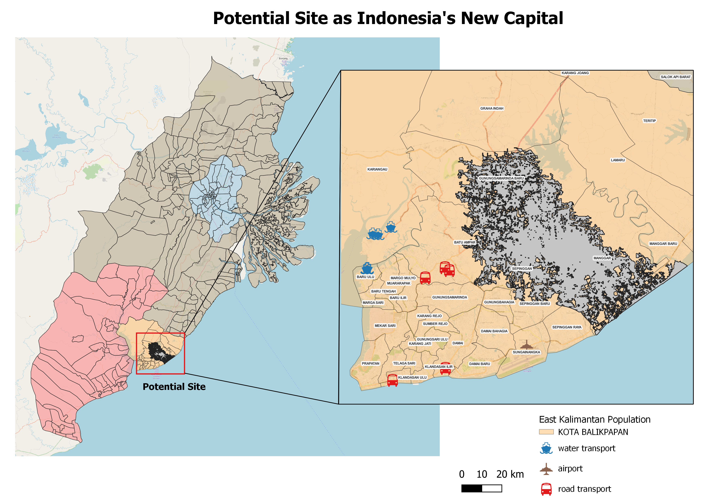

*In this section, you will find the recommended site obtained through AHP Suitability analysis, alongside a discusssion of the advantages and disadvantages of the site.*

*Do refer to our report here for the full analysis: [Site Suitability Analysis]()*

## AHP Scores 
Below are the AHP scores for the 8 factors, ranked according to importance. 

Factor | AHP Score
------------- | -------------
Safety Hazards (Forest Fires) | 34.9%
Accessibility (Road) | 22.4%
Sea Transportation | 15.8%
Flood Risk | 10.2%
Air Transport | 7.2%
Economic (Slope) | 4.7%
Environment Sustainability | 2.7%
Building Density | 2%

## Potential Site as Indonesia's New Capital

> *View our web map here: [potential site](https://winnielowsl.github.io/Site/#13/-1.2747/116.9375)*

The potential site chosen is in Kota Balikpapan, within several villages including *Manggar, Sepinggan, Gunung Samarinda Baru, and Batu Ampar*. 

##### ADVANTAGES
There are 4 main advantages of the site:

  * High number of transportation options with water ferries, road transport and an airport nearby. Additionally, roads in the area are well developed with the highest road density and road intersection compared to the areas. 
  * Risk of forest fires starting in the potential site is one of the lowest compared to the other locations.
  * The potential site has low slope values. This means that it will generally be less costly to build the new capital in this site. However, this also means that flood risk is increased as the site is rather close to the coast, with a few small rivers nearby. To combat this issue, the government can consider building more dams and sewage systems to prevent flooding in this area when the tide and rainfall is high.
  * The villages within the potential site in Balikpapan are not the most densely populated.This is considerably important as as a new capital, there will no doubt be more people moving into the area, such as long-term businessmen and workers when their companies shift over.

##### DISADVANTAGES
There are 4 main disadvantages of the site:

  * The potential site is lacking in both telecommunication and transmission towers. While Kota Balikpapan has 4 telecommunication towers, and 2 of them being near the potential site, the area itself does not have any telecommunication tower. For electric transmission towers, there is only 1 in the whole study area, where it is located at Tanah Datar in Kota Samarinda which is considerably far from the potential site. 
  * For bank locations, there are only 2 banks in the potential site - 1 each in Manggar and Manggar Baru. As a capital, it is necessary to include more banks as it is deemed as an important facility, especially for businessmen and workers coming in for work. As for retail and trade, there is only 1 traditional trade center in Manggar Baru, with no mall or department nearby.
  * There is a plot of forests in the potential site. While it is important to conserve forests, most of the locations in our study area have huge patches of forests, except for Penajam Paser Utara as there are more agricultural plots there. Even though there are other areas of Penajam Paser Utara that do not contain either agricultural plots or forests, from our analysis in task 1, we know that the area does not have much facilities, transportation, and is low in accessibility which makes the location undesirable.
  * The potential site is considerably concentrated with buildings, especially for Manggar with a building count of 12,830. While this can be an issue as it would mean that some buildings have to be carved out for offices and business developments, the government can consider converting existing buildings which are not as important into useful developments. Having a higher building density is not always necessarily a bad thing as well, as necessary infrastructure such as schools and offices are already available in the area.
  
##### CONCLUSION
No doubt, for any location, there will always be both advantages and disadvantages where there is no one size fits all solution. In our case, the team feels that the advantages strongly outweigh the disadvantages discussed. For things such as forest fires, there is no way we can control when a fire will start and hence the site is chosen as far away from the forest fires as possible. Whereas for the disadvantages listed above, things such as infrastructure and facilities can all be better improved by building them in the new potential location. 
