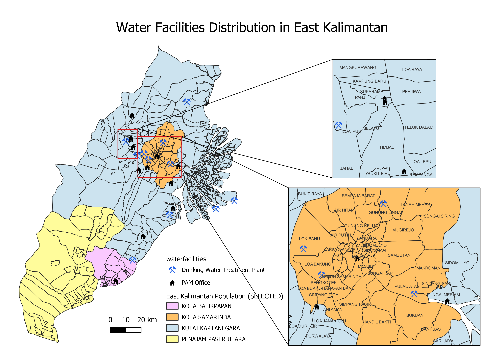
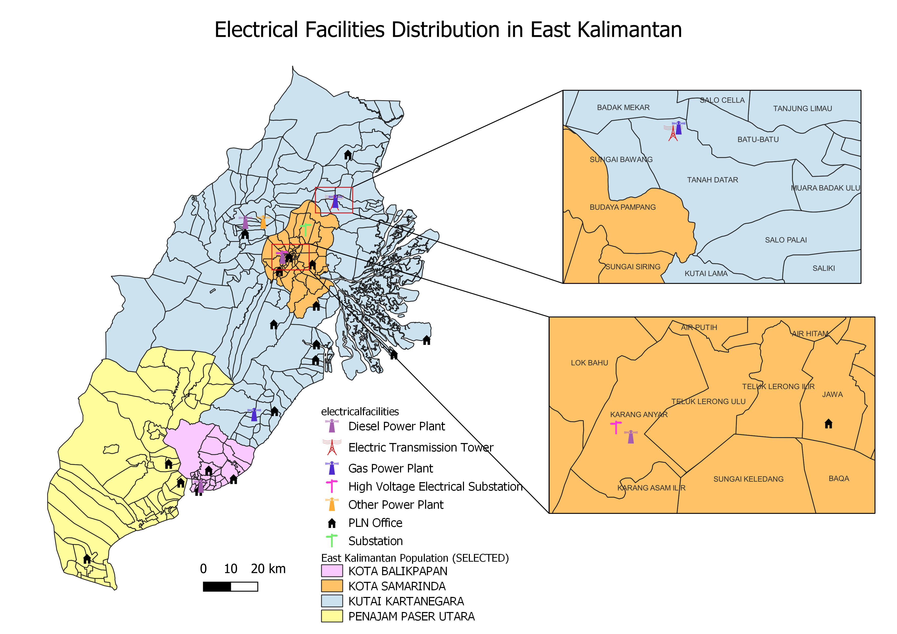
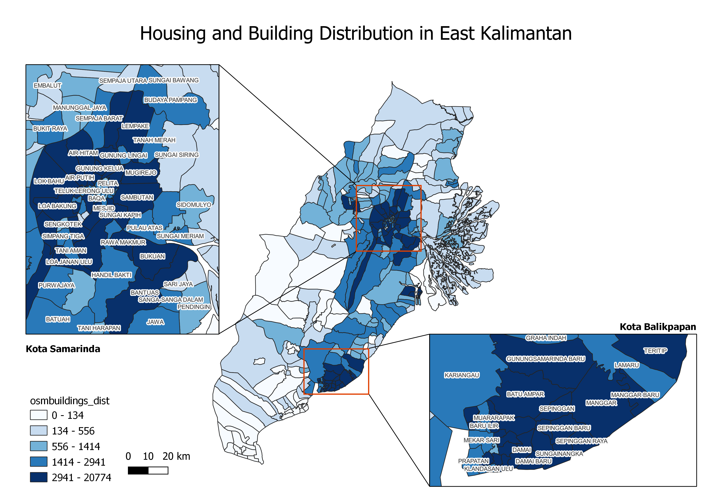

*These are some of the more important maps we created for each of the 5 themes, alongside the main insights for the map. Do refer to our report for all the maps and full analysis.*

## Population and Demographics
##### 1. BIVARIATE CHOROPLETH MAP

The most densely populated areas, Balikpapan City and Samarinda City, are dominated by a higher number of population who are aged 15 to 64. In contrast, the more rural areas, Penajam Paser Utara and Kutai Kartanegara, are coloured relatively homogeneously, with less population density and lower proportion of population between the age 15 to 64. 

## Economic and Business
##### 1. DISTRIBUTION OF TRADE AND RETAIL

##### 2. DISTRIBUTION AND SIZE OF OPEN MINING AREAS

## Transport and Communication
##### 1. VILLAGES WITH HIGHEST NUMBER OF TRANSPORTATION

*View our web map here: [transportation in east kalimantan]()*

The map above shows the overall distribution of transportation modes in East Kalimantan. The zoomed in maps show 2 villages with the highest transportation count of 4 each. Penajam has 2 water transports and 2 road transports. Whereas Sebulu Modern has 4 water transports. Overall, we can see how transportation is mainly concentrated at Kota Balikpapan and Kota Samarinda, where they both have an airport in the area as well. This is not surprising considering how these 2 areas are the cities. Additionally, it can be seen that transportation in Penajam Paser Utara is low, and the main transportation modes available in Kutai Kartanegara are ferries and boats. 

##### 2. ROAD DENSITY ANALYSIS

As seen from the map, distribution of roads is not even where there are a huge number of villages with high numbers of white grids (i.e. low road density), which means that the road network in that area is not yet developed. Apart from the 2 areas Kota Balikpapan and Kota Samarinda zoomed in on the map, the road density of other villages are considerably low as we can see how the grids are either in white or light orange. 

##### 3. DISTRIBUTION OF TELECOMMUNICATION TOWERS

There is a high concentration of telecommunication towers in Kota Samarinda, especially at the center of Kota Samarinda with villages with more than 1 telecommunication tower, such as Sempaja Timur. These areas thus have better signal compared to the rest of the villages in our study area. Telecommunication towers are fairly spread out in Kutai Kartanegara, and there is a rather low number of telecommunication towers in both Kota Balikpapan and Penajam Paser Utara. 

## Environment and Hazard
##### 1. COMBINED FOREST FIRE HOTSPOTS

From our yearly analysis, we saw how the villages in the north-east and southern part of Kutai Kartanegara were always prone to forest fires. It is not surprising that in our overall analysis, these villages have the highest concentrations of forest fires once again. Because of that, Kota Samarinda is also flagged as an area with rather high risks of forest fires as it is sandwiched between 2 areas which have a high number of forest fires and hence the chances of the fires spreading there is rather high.

##### 2. FLOOD RISK AREAS

The above map shows which are the locations of the major river course and coastlines in our study area. As seen, there is a major river which cuts across various villages in Kota Samarinda and Kutai Kartanegara. This river connects to the coast which increases the risks of flooding when there is high tide or heavy rainfall. Additionally, the coastline cuts across several villages in both Kota Balikpapan and Penajam Paser Utara, with a few rivers connecting to it as well. After creating slope maps, we realized that these areas have rather low values for slopes, which hence increases the chances of flood. 

## Infrastructure
##### 1. SOURCES OF ENERGY

The majority of East Kalimantan’s energy production activity lies within Kutai Kartanegara. Penajam Paser Utara and Kota Balikpapan are not involved in the gas and oil production industry, while Kota Samarinda only has one oil fuel depot in its area. Indonesia is heavily dependent on gas and oil exports for economic growth, where East Kalimantan is one of Indonesia’s main sources of gas and oil production. Therefore, the new selected site for the capital should avoid areas with gas and oil facilities so as to not disrupt production activities as it plays a crucial role in sustaining Indonesia’s economy as a whole.

##### 2. WATER FACILITIES

The map above shows the distribution of 2 types of water facilities: drinking water treatment plants and PAM offices (Indonesia owned tap water company). We can see that the distribution of water facilities is rather unequal – Penajam Paser Utara has 0 water facilities, while Kota Balikpapan only has 1 PAM office in its area. Majority of the water treatment plants and PAM offices are situated in Kutai Kartanegara and Kota Samarinda, and the facilities within each district are rather evenly distributed. 

##### 3. ELECTRICAL FACILITIES

At a glance, we can see that there is a severe lack of power grid facilities in Penajam Paser Utara. The area only consists of 3 PLN Offices (Indonesia’s state owned electricity company). In contrast, the other districts each have at least 1 power plant within their region, with Kota Balikpapan and Kota Samarinda having 1 power plant each, and Kutai Kartanegara having a total of 4 power plants. Kota Samarinda and Kutai Kartanegara have other supporting facilities, with the former having 2 substations and the latter having 1 transmission tower. 

##### 4. HOUSING AND BUILDING DISTRIBUTION

As we can see from the map, the building distribution is highly skewed and uneven across the whole of East Kalimantan. 80% of the villages have building counts ranging from 0 to a maximum of 2941 buildings only. As observed from the map, these villages are likely to be situated in Penajam Paser Utara and Kutai Kartanegara. The remaining 20% of villages house majority of the buildings, with the building counts ranging from 2941 to a maximum of 20774 buildings within a single village. This means that the building density in these villages is very concentrated. As seen, these villages lie in Kota Balikpapan and Kota Samarinda. 
